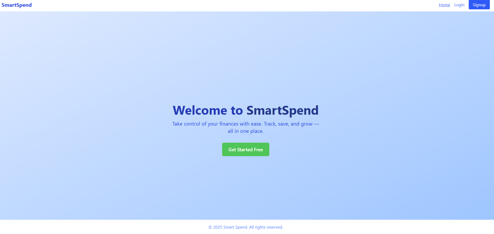

# SmartSpend – Expense Tracker App

##  Overview
SmartSpend is a full-stack web application that helps users track, categorize, and visualize their expenses. It supports secure user login, personal dashboards, transaction/category management, report generation, and account settings. Built to be scalable with multi-user collaboration in mind.

##  Screenshot

##  Links
- Live Site: [https://smartspends.netlify.app](https://smartspends.netlify.app)

---

##  My Process

###  Built With
- Java script
- React
- Tailwind CSS
- Node.js & Express
- MongoDB + Mongoose
- JWT Authentication
- bcrypt
- cors
- Netlify & Render for deployment
- Chart libraries: `recharts`
- State management via React Context API
---

###  What I Learned
- **Table-wise displaying**: Handling large sets of transaction/category data efficiently with dynamic rendering.
- **Debouncing**: Reduced unnecessary API calls while typing (search, filters, etc.).
- **Batch Posting**: Implemented functionality to submit multiple transactions at once.
- **CORS issues**: Understood and resolved cross-origin errors in Express with custom origin handling.
- **Bar chart visualizations**: Successfully implemented charting (after previous failed attempts in other projects) using `recharts`.
- **JavaScript debugging**: Improved use of browser dev tools and `console.log()` for identifying runtime issues and async flow.
- **Modular backend design**: Created clean route/controller structure for scalability and easier maintenance.
- **Global Window Object**: Learned how to access various properties and methods globally using the window object.

---

### Continued Development
Next steps I'm planning to implement:
- **Team collaboration**:
  - Invite collaborators with different privileges , admin, viewer.
  - Admin account creator can assign roles and manage access.
- **Import from Excel/PDF**:
   - uploadeing batch datas form bank or credit statements pdf/excel that makea easier and save time.
  - **Implement proper erorr handling** :
  - using inline valdation or using toast dependecies
  - currently am using alert erorr handling messages to have basic user expernices
  - implment Pagination and other styles for better data managment.

---

###  Useful Resources
- [**MDN Web Docs**](https://developer.mozilla.org/en-US/docs/Web/HTTP/Guides/CORS/Errors): Helped understand and resolve complex CORS issues.
- [**Mermaid.js**](https://www.mermaidchart.com/app/dashboard): Used to generate visual diagrams for app architecture and data flow.
- [**Recharts **](https://recharts.org/en-US): Open-source library used for rendering bar charts with transaction/category data.
- [ emojipedia](https://emojipedia.org/inbox-tray):for using some arrows signs
-[**fivcon***](https://freesvgicons.com/search?q=financ) :using icon at app
- **Stack Overflow & GitHub Issues**: For solving bugs and edge cases.

---

##  Author
**Meron Qelati**  
[Meron Teweldebrhan](www.linkedin.com/in/meron-teweldebrhan)  
[Meron Teweldebrhan](https://github.com/yourusername)

---

## 🙏 Acknowledgments
Big thanks to:
- To Perscholas org for given us this oppurtunity .
- Our instructors **Colton** and **Abrham**
- My fellow learners, for sharing resources and support throughout the project

